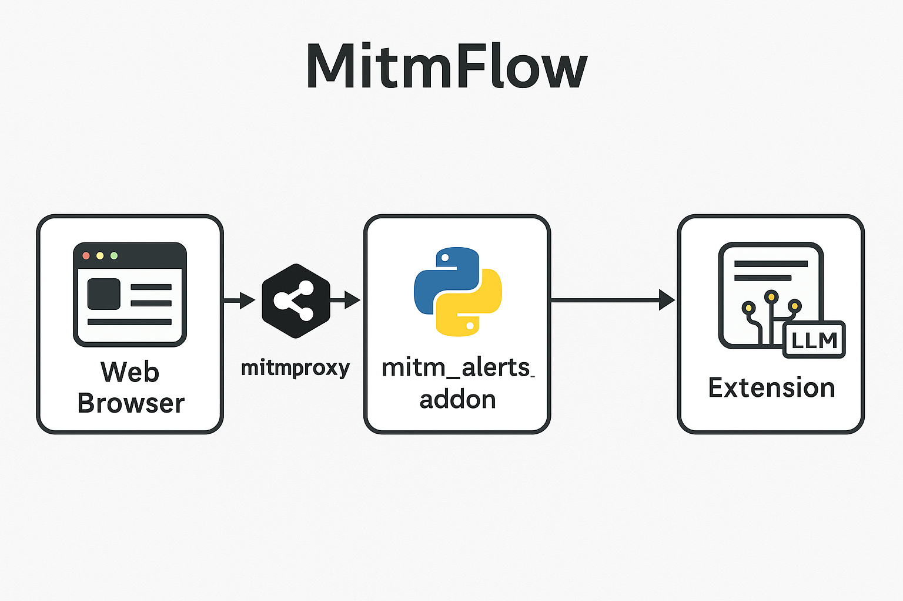

# MitmFlow

**MitmFlow** is a research prototype for **real-time detection of sensitive personal data leaks in web traffic**.  
It combines a **mitmproxy-based network interceptor** with a **Chrome browser extension** to detect, analyze, and notify users when personally identifiable information (PII) is leaked to third parties via HTTP/HTTPS requests.

This project was developed as part of an academic research effort focused on **privacy-aware network monitoring and user-side alerting**.

---

## Key Features

- **Real-time PII leak detection** in outbound web traffic
- Detects:
  - Email addresses
  - Canadian phone numbers (with province mapping)
  - Canadian postal codes (FSA-based province inference)
- **Sensitive data masking** before sending alerts to the client
- **Server-Sent Events (SSE)** for low-latency browser notifications
- **De-duplication logic** to prevent alert spam
- **In-page visual warning** when a leak is detected
- **Browser notifications + popup history**
- Noise suppression for common tracking and analytics domains

---

## System Architecture

MitmFlow uses a hybrid architecture:

1. **mitmproxy add-on (Python)**  
   - Intercepts HTTP/HTTPS requests
   - Inspects URLs, headers, and body content
   - Identifies PII via regex-based detection
   - Masks sensitive values
   - Streams alerts via an embedded SSE server

2. **Chrome Extension**
   - Listens to SSE alerts
   - Displays system notifications
   - Shows alerts in an extension popup
   - Injects in-page warning banners



---

## Repository Structure

```text
MitmFlow/
├── mitmproxy-addon/
│   └── mitm_alerts_addon.py   # mitmproxy add-on + SSE server
├── extension/
│   ├── manifest.json
│   ├── background.js          # SSE client + notification logic
│   ├── content.js             # In-page visual alerts
│   ├── popup.html
│   ├── popup.js
│   └── icons/
├── docs/
│   ├── architecture.png
│   └── screenshots/
├── README.md
├── LICENSE
└── .gitignore
```

## Requirements

Python 3.8+

mitmproxy

Chrome or any Chromium-based browser

Basic knowledge of HTTP/HTTPS proxy configuration

---
## Installation
1. Clone the repository
```bash
git clone https://github.com/AfrinNaz/MitmFlow.git
cd MitmFlow
```

2. Install mitmproxy:
```bash
pip install mitmproxy
```
---

## Usage
Step 1: Start mitmproxy with the add-on:
mitmproxy -s mitmproxy-addon/mitm_alerts_addon.py


By default, the SSE server starts on:

http://localhost:5000


Step 2: Configure your browser

1) Set your browser’s proxy to localhost:8080

2) Visit http://mitm.it and install the mitmproxy CA certificate

3) Trust the certificate in your OS/browser


Step 3: Load the Chrome extension

1) Open Chrome and go to: chrome://extensions

2) Enable Developer mode

3) Click Load unpacked

4) Select the extension/ directory


Step 4: Test

Browse websites with input forms (e.g., contact forms, pharmacy or medical sites)

Submit an email, phone number, or postal code

You will see:

a. Desktop browser notification

b. In-page warning banner

c. Alert listed in the extension popup

---

## Noise Filtering

Common analytics and tracking domains (e.g., Google Analytics, Facebook) are filtered in background.js to reduce alert noise.


---

## Screenshots

| Scenario                      | Example                             |
| ----------------------------- | ----------------------------------- |
| Email leaked via contact form | `docs/screenshots/email-leak.png`   |
| Phone & postal code detected  | `docs/screenshots/phone-postal.png` |
| Browser popup alert           | `docs/screenshots/popup-alert.png`  |
